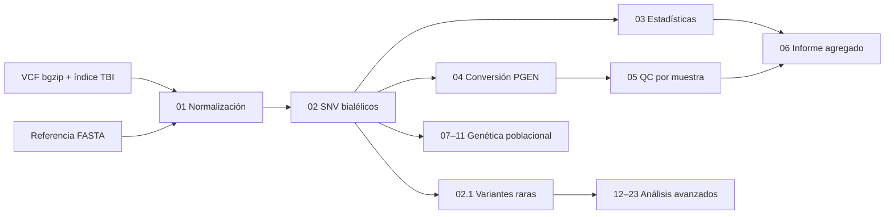

# DNABR QC y análisis exploratorio en HPC

Pipeline reproducible para control de calidad, transformación y análisis
exploratorio de datos genómicos. Está implementado con Nextflow DSL2 y diseñado
para ejecutar cada proceso como un trabajo independiente en un clúster Slurm,
dentro de una imagen Singularity.

La rama `hpc` reúne el flujo principal, los módulos de análisis, la
configuración de recursos y la receta del contenedor. Los datos individuales,
metadatos clínicos, referencias, resultados y registros de ejecución deben
permanecer fuera del repositorio.

## Alcance

El pipeline permite:

- normalizar VCF por cromosoma y descomponer variantes multialélicas;
- seleccionar SNV bialélicos y, de forma opcional, variantes `PASS`;
- producir estadísticas con bcftools y conjuntos PGEN con PLINK 2;
- calcular missingness y heterocigosidad por muestra;
- generar un informe agregado de control de calidad;
- extraer y caracterizar variantes raras;
- analizar SFS, DAF, dSFS, LD y tag SNP;
- estudiar distancias entre variantes, segmentos compartidos y comunidades;
- integrar ancestría local, asIBD, presencia en paneles externos y covariables;
- construir conjuntos de modelado y benchmarks reproducibles.

Los módulos avanzados están desactivados por defecto. La ejecución inicial
procesa el núcleo de QC, módulos 01 a 06.

## Arquitectura general



Nextflow actúa como controlador del flujo. El perfil
`slurm_singularity` envía los procesos a Slurm, aplica los recursos definidos
en `conf/auto_resources.config` y ejecuta las herramientas dentro del
contenedor indicado por `container_image`.

## Módulos

| Módulo | Función principal | Activación |
|---|---|---|
| 00 | Comprobación de Slurm, contenedor y Python | `enable_smoke_test` |
| 01 | Normalización y left alignment | `run_qc` + `enable_norm` |
| 02 | SNV bialélicos y filtrado `PASS` | `run_qc` + `enable_filter` |
| 02.1 | VCF de variantes raras | `enable_lai_rare` |
| 03 | Estadísticas de bcftools | `run_qc` + `enable_bcfstats` |
| 04 | Conversión VCF a PGEN | `run_qc` + `enable_pgen` |
| 05 | Missingness y heterocigosidad | `run_qc` + `enable_missing_het` |
| 06 | Informe agregado de QC | `run_qc` + `enable_report` |
| 07–09 | SFS, alelo ancestral, DAF y dSFS | `run_downstream` + indicadores específicos |
| 10–11 | Decaimiento de LD y tag SNP | `run_downstream` + indicadores específicos |
| 12 | Distribución de tractos de SNP raros | `enable_rare_snp_tracts` |
| 13 | Distancias entre SNP por individuo | `enable_individual_snp_distance_modes` |
| 14 | Segmentos de alelos raros compartidos | `enable_rare_allele_painting` |
| 16.5 | Comunidades, Leiden, Sym-NMF y visualizaciones | `enable_ibd_enhanced` |
| 17 | Variantes raras sobre tractos de ancestría local | `enable_rare_in_lai` |
| 18 | Comparación con asIBD de variantes comunes | `enable_asibd_comparator` |
| 19 | Figura de variantes raras sobre painting LAI | `enable_rare_on_lai_painting` |
| 20 | Construcción del feature store | `enable_feature_build` |
| 21 | Canal de presencia en paneles externos | `enable_presence_channel` |
| 22 | Cohorte de modelado, split, CV y evaluación | `run_model_pipeline` + indicadores de etapa |
| 23 | Matriz rara y benchmark particionado | `run_rare_bench` + indicadores de etapa |

Los parámetros completos y sus valores predeterminados están documentados
junto al código en `nextflow.config`.

## Estructura del repositorio

```text
.
├── main.nf                    # Flujo principal y conexión entre módulos
├── nextflow.config            # Parámetros generales y perfil Slurm
├── hpc.config                 # Valores de ejemplo para un entorno HPC
├── modules/                   # Procesos Nextflow DSL2
├── bin/                       # Programas Python y R usados por los procesos
├── conf/
│   ├── auto_resources.config  # CPU, memoria, paralelismo y reintentos
│   ├── resources.config       # Configuración auxiliar de recursos
│   └── empty.txt              # Entrada vacía usada por canales opcionales
├── scripts/                   # Gráficos y ajuste de recursos
├── tools/                     # Preparación de referencias y contenedor
└── tests/                     # Pruebas funcionales del módulo 23
```

## Requisitos

### Controlador

- Linux o un sistema POSIX compatible;
- Java 17 o posterior;
- Nextflow;
- acceso a un clúster Slurm;
- Singularity CE, o Apptainer con una configuración compatible;
- Git para descargar y versionar el pipeline.

La mayor parte de las dependencias científicas se ejecuta dentro del
contenedor: bcftools, samtools, PLINK 2, Python, R y sus bibliotecas.

Documentación oficial:

- [Instalación de Nextflow](https://www.nextflow.io/docs/latest/install.html)
- [Documentación de Slurm](https://slurm.schedmd.com/overview.html)
- [Construcción de imágenes Apptainer](https://apptainer.org/docs/user/latest/build_a_container.html)
- [Guía de SingularityCE](https://docs.sylabs.io/guides/latest/user-guide/)

Compruebe el entorno antes de desplegar:

```bash
java -version
nextflow -version
sbatch --version
singularity --version
```

Si el clúster ofrece únicamente el comando `apptainer`, compruebe la
compatibilidad con el perfil incluido. El perfil actual activa
`singularity.enabled`.

## Instalación

Descargue únicamente la rama HPC:

```bash
git clone \
  --branch hpc \
  --single-branch \
  https://github.com/jfct777/lai-exploracion-datos.git

cd lai-exploracion-datos
```

## Construcción del contenedor

La receta `tools/exploracion-datos-to-lai.def` extiende la imagen
`etherium/dnabr-qc:27-01-2026` e incorpora `procps`, necesario para la
supervisión de procesos de Nextflow.

Con Singularity:

```bash
mkdir -p "$HOME/images"

singularity build \
  "$HOME/images/dnabr-qc-hpc.sif" \
  tools/exploracion-datos-to-lai.def
```

Con Apptainer:

```bash
mkdir -p "$HOME/images"

apptainer build \
  "$HOME/images/dnabr-qc-hpc.sif" \
  tools/exploracion-datos-to-lai.def
```

Algunos clústeres requieren `--fakeroot`, una construcción remota o que la
imagen sea preparada por el equipo de infraestructura. Verifique el resultado:

```bash
singularity test "$HOME/images/dnabr-qc-hpc.sif"

singularity exec "$HOME/images/dnabr-qc-hpc.sif" \
  sh -c 'bcftools --version | head -n 1; plink2 --version; python3 --version'
```

## Preparación de entradas

### VCF

`vcf_dir` debe contener un VCF comprimido con bgzip y su índice `.tbi` por
cromosoma. El patrón predeterminado es:

```text
dnabr.hg38.2723.chr1.vcf.gz
dnabr.hg38.2723.chr1.vcf.gz.tbi
dnabr.hg38.2723.chr2.vcf.gz
dnabr.hg38.2723.chr2.vcf.gz.tbi
...
dnabr.hg38.2723.chrX.vcf.gz
dnabr.hg38.2723.chrX.vcf.gz.tbi
```

El patrón aceptado se controla con `chr_regex` y reconoce `1–22`, `X`, `Y` y
`MT`.

### Referencia

`ref_fasta` debe corresponder al mismo ensamblaje de los VCF. El módulo 01
crea el índice `.fai` en su directorio de trabajo si no está disponible.

### Directorios

Use ubicaciones externas al clon:

- `outdir`: resultados publicados;
- `workdir`: caché de trabajo de Nextflow;
- `container_image`: imagen SIF;
- referencias y metadatos: rutas de solo lectura cuando sea posible.

`workdir` debe estar en un sistema de archivos compartido y persistente para
que `-resume` funcione desde cualquier nodo.

## Configuración

`hpc.config` contiene valores de ejemplo para un clúster concreto. No asuma
que esas rutas existen en otro entorno. Sobrescriba como mínimo:

- `vcf_dir`;
- `ref_fasta`;
- `outdir`;
- `workdir`;
- `container_image`;
- `slurm_queue`;
- `slurm_account` y `slurm_qos`, si el clúster los exige.

Para no modificar archivos versionados, guarde los parámetros del sitio fuera
del repositorio, por ejemplo en `/ruta/privada/dnabr-qc.params.yml`:

```yaml
vcf_dir: /datos/dnabr/vcf
ref_fasta: /referencias/hg38/Homo_sapiens_assembly38.fasta
outdir: /resultados/dnabr_qc
workdir: /scratch/usuario/dnabr_qc_work
container_image: /home/usuario/images/dnabr-qc-hpc.sif

slurm_queue: cpu
slurm_account: null
slurm_qos: null

run_qc: true
run_downstream: false

enable_norm: true
enable_filter: true
enable_bcfstats: true
enable_pgen: true
enable_missing_het: true
enable_report: true
```

Los parámetros sensibles o que apuntan a metadatos tienen valor `null` y deben
proporcionarse de forma explícita cuando se activa el módulo correspondiente.

## Validación inicial del despliegue

El módulo 00 comprueba Slurm, el contenedor y Python sin leer datos genómicos:

```bash
nextflow -c hpc.config run main.nf \
  -profile slurm_singularity \
  -params-file /ruta/privada/dnabr-qc.params.yml \
  --enable_smoke_test true \
  --run_qc false \
  --run_downstream false
```

El resultado esperado es:

```text
<outdir>/00_smoke_test/smoke_test.txt
```

El archivo debe terminar en `OK` y contener un identificador de trabajo de
Slurm.

## Ejecución del núcleo de QC

```bash
nextflow -c hpc.config run main.nf \
  -profile slurm_singularity \
  -params-file /ruta/privada/dnabr-qc.params.yml \
  -resume \
  -with-report /ruta/resultados/dnabr_qc/execution_report.html \
  -with-trace /ruta/resultados/dnabr_qc/execution_trace.tsv \
  -with-timeline /ruta/resultados/dnabr_qc/execution_timeline.html
```

El núcleo ejecuta:

```text
VCF → normalización → filtrado → estadísticas/PGEN
    → QC por muestra → informe agregado
```

Los resultados principales se publican bajo:

```text
<outdir>/
├── 01_norm/
├── 02_filter/
├── 03_bcftools_stats/
├── 04_plink_pgen/
├── 05_plink_qc/
└── 06_report/
    ├── merged_per_sample.tsv
    ├── flags_per_sample.tsv
    ├── summary.json
    ├── report.html
    └── plots/
```

## Variantes raras

Para generar VCF raros a partir de la salida del módulo 02:

```bash
nextflow -c hpc.config run main.nf \
  -profile slurm_singularity \
  -params-file /ruta/privada/dnabr-qc.params.yml \
  -resume \
  --enable_lai_rare true \
  --lai_rare_max_maf 0.01 \
  --lai_rare_min_mac 2 \
  --lai_rare_keep_format GT
```

Los archivos se publican en `<outdir>/lai_rare/`. Si se desactiva el módulo 02,
`filtered_input_dir` puede apuntar a una ejecución previa con VCF filtrados.

## Ejecución de módulos avanzados

Los módulos 12–23 pueden consumir resultados ya publicados. En ese caso,
desactive el núcleo y proporcione las entradas requeridas:

```bash
nextflow -c hpc.config run main.nf \
  -profile slurm_singularity \
  -params-file /ruta/privada/dnabr-qc.params.yml \
  -resume \
  --run_qc false \
  --run_downstream false \
  --enable_rare_allele_painting true \
  --painting_input_dir /ruta/a/lai_rare \
  --painting_results_dir /ruta/a/resultados/14_rare_allele_sharing
```

Consideraciones:

- los módulos 12–14 esperan VCF raros y sus índices;
- los módulos 17 y 19 requieren archivos MSP de Gnomix;
- el módulo 18 requiere archivos asIBD;
- el módulo 20 requiere resultados de M14 y un archivo externo de metadatos;
- el módulo 21 requiere paneles previamente preparados con
  `tools/stage_presence_panels.sh`;
- el módulo 22 requiere `run_model_pipeline=true` y las entradas explícitas de
  cada etapa;
- el módulo 23 requiere `run_rare_bench=true`, un manifiesto de split y un
  modeling master.

Revise el bloque del módulo en `nextflow.config` antes de activarlo. El pipeline
detiene la ejecución cuando falta una entrada obligatoria o cuando los formatos
no cumplen el contrato esperado.

## Despliegue como trabajo controlador

El pipeline no es un servicio web. Su despliegue consiste en mantener un
proceso controlador de Nextflow desde el cual se envían trabajos a Slurm.

Puede ejecutarse desde un nodo de acceso persistente, una sesión `tmux` o un
trabajo controlador, según la política del clúster. Ejemplo de lanzador:

```bash
#!/usr/bin/env bash
#SBATCH --job-name=dnabr_qc_controller
#SBATCH --partition=cpu
#SBATCH --cpus-per-task=2
#SBATCH --mem=8G
#SBATCH --time=5-00:00:00
#SBATCH --output=/ruta/resultados/dnabr_qc/controller_%j.log

set -euo pipefail

cd /ruta/al/repositorio

nextflow -c hpc.config run main.nf \
  -profile slurm_singularity \
  -params-file /ruta/privada/dnabr-qc.params.yml \
  -resume
```

Guarde este lanzador fuera del repositorio y envíelo con:

```bash
sbatch /ruta/privada/launch_dnabr_qc.sbatch
```

Este patrón requiere que el clúster permita enviar trabajos Slurm desde el
nodo donde se ejecuta el controlador.

## Reanudación y reproducibilidad

- mantenga estable `workdir`;
- reutilice exactamente la misma imagen SIF;
- no modifique las entradas durante una ejecución;
- use `-resume` después de una interrupción;
- conserve el comando, la versión de Nextflow y el hash del contenedor.

```bash
nextflow -version
sha256sum /ruta/a/dnabr-qc-hpc.sif
```

Los módulos 22 y 23 producen manifiestos y hashes adicionales para verificar
entradas, salidas y reanudaciones.

## Ajuste de recursos

`conf/auto_resources.config` define CPU, memoria, `maxForks` y políticas de
reintento por proceso. Antes de usar otro clúster:

1. revise límites de partición, memoria y tiempo;
2. ajuste `slurm_queue`, `slurm_account` y `slurm_qos`;
3. reduzca `maxForks` si el planificador limita trabajos simultáneos;
4. valide primero con el módulo 00 y uno o dos cromosomas;
5. revise `sacct` antes de ampliar a todo el genoma.

Los parámetros globales `cpus`, `memory` y `time` funcionan como valores base;
los bloques `withName` aplican los recursos específicos.

## Comprobaciones del repositorio

Validar la configuración efectiva:

```bash
nextflow -c hpc.config config \
  -profile slurm_singularity \
  -o flat \
  .
```

Comprobar la sintaxis de las herramientas shell:

```bash
for script in tools/*.sh; do
  bash -n "$script"
done
```

Ejecutar las pruebas del módulo 23 dentro del contenedor:

```bash
singularity exec "$HOME/images/dnabr-qc-hpc.sif" \
  python3 tests/test_m23_oom_retry_policy.py

singularity exec "$HOME/images/dnabr-qc-hpc.sif" \
  python3 tests/test_partition_equivalence.py
```

## Resolución de problemas

### No se descubren VCF

Compruebe `vcf_dir`, `chr_regex`, el nombre exacto de los archivos y la
existencia de cada `.tbi`.

### Falta una salida previa

Cuando una etapa está desactivada, el flujo intenta descubrir resultados ya
publicados. Verifique `outdir`, `filtered_input_dir` y los directorios de entrada
del módulo.

### El contenedor no ve una ruta

Mantenga entradas, resultados y `workdir` en sistemas de archivos montados en
los nodos. Si necesita otra ruta, añada el bind mínimo necesario en
`singularity.runOptions`.

### `-resume` vuelve a ejecutar tareas

Confirme que no cambiaron el código, los parámetros, las rutas de entrada, el
contenedor ni `workdir`. Nextflow invalida la caché cuando cambia la firma de
una tarea.

### Slurm termina trabajos sin código de salida

Revise `sacct`, la memoria, el tiempo solicitado y la salud del nodo. El perfil
incluye reintentos acotados para terminaciones externas, pero los errores del
comando no se reintentan de forma general.
